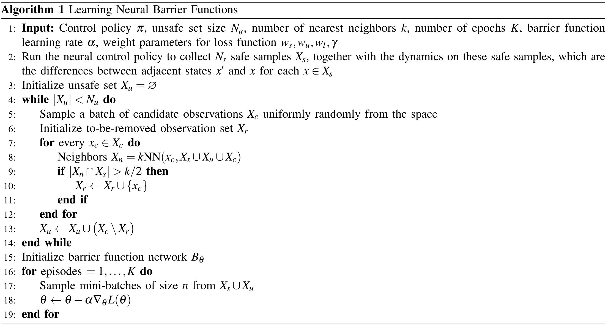
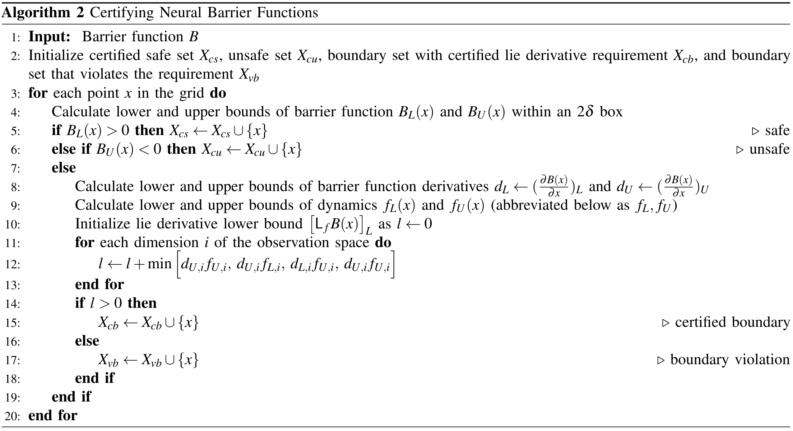
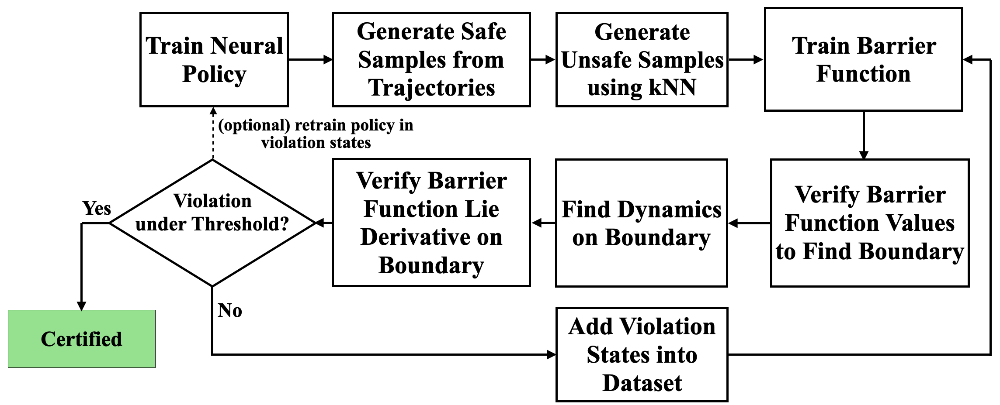
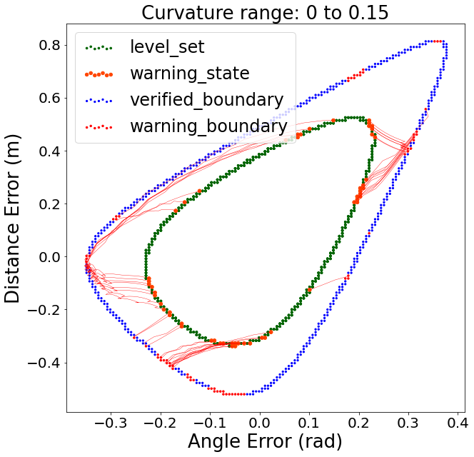

# Learning Barrier Certificates for Neural Path Tracking Control of Self Driving Vehicles - Extension

An extension of paper *Learning Barrier Certificates for Neural Path Tracking Control of Self Driving Vehicles* is contained in the [PDF file](./Quantifying_Safety_of_Learning-based_Self-Driving_Control_Using_Almost_Barrier_Functions_Supplementary_Materials.pdf), with the following sections

1. Pseudocodes
2. Policy Learning
3. Learning Low-Dimensional Barriers under Partial Observability
4. Estimating Range of Dynamics near Samples
5. Finding Boundary Counterexamples for Retraining
6. Using the Learned Barrier Function for Safety Monitor
7. Hyper-parameters and Details of Experiments

Below we present figures contained in the original and extended paper.

---

## Pseudocodes

### Training the Barrier Function

  

### Cerifying the Barrier Function

  

## Dynamic Model Trajectories Illustration

Plotting of trajectories of the dynamic model, with x, y axes as angle and distance errors, and z axis as:

Longitudinal Speed         |  Lateral Speed           | Yaw Rate
:-------------------------:|:------------------------:|:-------------------------:
  |    |  

---

## Flow Chart of Overall Pipeline

  

---

## Vehicle Dynamics Models

Kinematic Model      |  Dynamic Model    
:-------------------------:|:------------------------:
  |   

---

## Barrier Functions

The barrier functions on kinematic model, dynamic model and TORCS environment

Kinematic Model (3D)       |  Dynamic Model (2D)      | TORCS (2D)
:-------------------------:|:------------------------:|:-------------------------:
  |    |  

---

## Safety Monitor

Backward reachable states for dynamic model, evaluated on a maximum curvature of 0.15, for 50 time steps

Path with Curvature 0.15 (Curve to Left)   |  Path with Curvature 0.15 (Curve to Right)       | Safety Monitor
:-------------------------:|:------------------------:|:-------------------------:
  |    | 
 

---

## Importance of Retraining

The barrier function for dynamic model obtained after the initial training and after the final retraining, projected in the dimensions of angle and distance error

Initial Barrier      |  Final Barrier     
:-------------------------:|:------------------------:
  |   

---

## Vector Fields of Dynamic Model

Close to Collected Trajectories      |  Whole Certification Grid     
:-------------------------:|:------------------------:
  |   

---

## Barrier Behavior of TORCS Environment

  

